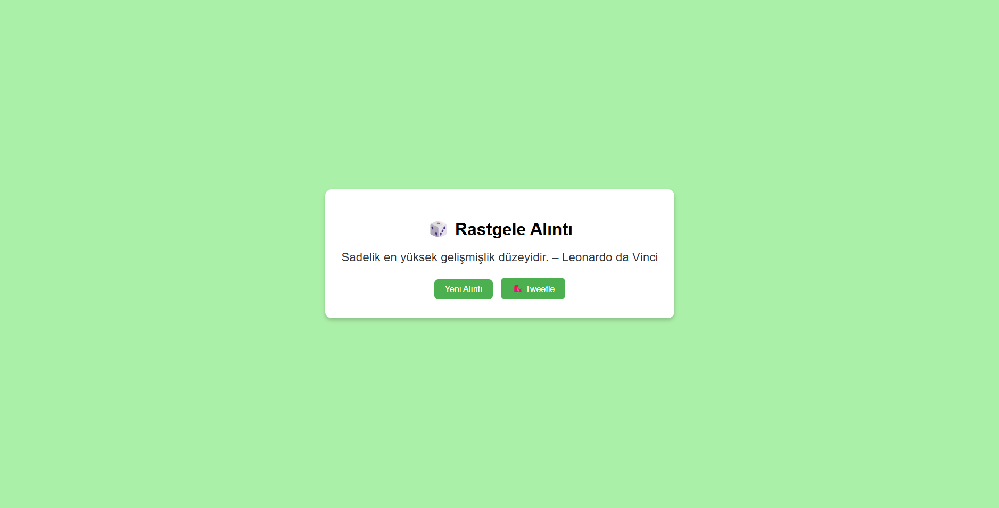

# 🎲 Rastgele Alıntıyı Alıp Tweet Atma Uygulaması

Bu proje, **Node.js + Express backend** ve **Vanilla JS frontend** kullanılarak geliştirilmiş basit bir **Rastgele Alıntı Uygulaması**dır.  
Alıntılar `quotes.json` dosyasından çekilmektedir. API limiti yoktur, tamamen offline çalışır 🚀  

## 📂 Proje Yapısı

```
random-quote-generator/
├── index.html # Ön yüz (HTML)
├── style.css # Stil dosyası
├── script.js # Frontend JS (API çağrısı, tweet butonu)
├── server.js # Express backend
├── quotes.json # Türkçe alıntı havuzu
├── package.json # Proje ayarları ve bağımlılıklar
└── node_modules/ # (npm install sonrası oluşur)
```

## 🚀 Çalıştırma

1. Bağımlılıkları yükle:
   ```bash
   npm install

2. Server’i başlat:
    ```bash
    node server.js

3. Tarayıcıdan index.html dosyasını aç.

✨ Özellikler
    ```
    Rastgele Türkçe alıntı gösterme 📜

    Arka plan rengini her alıntıda değiştirme 🎨

    🐦 Alıntıyı Twitter’da paylaşabilme.
    ```

🖼️ Ekran Görüntüsü
    

📜 Lisans

    Bu proje MIT lisansı altında paylaşılmıştır.